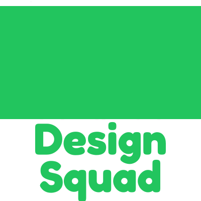

<p align="center">
  
</p>

# Design Squad

A portable AI design team powered by [Squad](https://github.com/bradygaster/squad). Drop it into any project and get a consistent, fixed-composition team of design-focused agents.

## Team

| Member            | Role                 | Model           |
| ----------------- | -------------------- | --------------- |
| **Oracle** 🧿     | Strategic Advisor    | `gpt-5.4`       |
| **Researcher** 🔍 | Research & Discovery | configurable    |
| **Planner** 📐    | Spec & Flow Planning | configurable    |
| **Builder** 🔨    | Implementation       | `gpt-5.3-codex` |

### Squad Helpers

Available to every core member via shared skills:

| Helper         | What it does                                                                |
| -------------- | --------------------------------------------------------------------------- |
| **Figma** 🎨   | Connects to Figma MCP for design file context — components, tokens, layouts |
| **Copilot** 🤖 | Assigns background coding tasks — scaffolding, CSS, codegen                 |
| **Agentation** 🎯 | Turns browser annotations into task contracts and GitHub routing            |

## Agentation -> GitHub Routing Flow

Use this when you want browser annotation feedback normalized into a task contract and auto-routed to the right squad label.

### Do I need `design-squad init`?

- **Recommended:** yes. `init` wires `.squad/` templates, required workflow files, and package scripts automatically.
- **If you manually copy files:** it can still work, but you must ensure workflows and scripts exist yourself.
- Run verification anytime with:

```bash
npx github:your-org/design-squad doctor
```

### One-command issue creation

```bash
bun run agentation:issue \
  --title "Fix nav overlap on mobile" \
  --comment "Header nav overlaps logo at 375px on /home" \
  --annotation-id "annot-123" \
  --severity "medium" \
  --complexity "auto" \
  --component "Header" \
  --page "/home" \
  --selector ".site-nav" \
  --screenshot "https://example.com/snap.png"
```

What this does:

- Creates a machine-readable task contract under `.squad/agentation-tasks/`
- Mirrors the latest lifecycle state under `.squad/orchestration-log/agentation/`
- Auto-routes **straightforward** work to `squad:copilot`
- Keeps **complex** or **unclear** work with `squad:builder`
- Creates a GitHub issue in the current repo (or pass `--repo owner/repo`)
- Falls back to a local markdown task file if GitHub is unavailable

Requirements:

- `gh` CLI authenticated (`gh auth login`)
- Repo workflow secrets/config already set for Copilot assignment

Fallback note:

- Without GitHub access, feedback is saved under `.squad/agentation-fallback/`.
- Retry a failed handoff later with `--replay-task .squad/agentation-tasks/<task-id>.json`.
- Use `--dry-run` to inspect routing before mutating GitHub.
- Full automation for straightforward fixes requires GitHub issue routing with `squad:copilot`.

## Quick Start

### Add to any project (one command)

```bash
npx github:your-org/design-squad init
```

This scaffolds `.squad/`, `squad.config.ts`, and `.squad-templates/` into your current directory. Then run:

```bash
npx squad
```

> **Private repo?** Works automatically if you have GitHub access (SSH key or `gh auth`).

### Run from this repo directly

```bash
bun install
npx squad
```

### Manual setup (alternative)

Copy the portable squad configuration into any repo:

```bash
cp -r .squad/ <your-project>/.squad/
cp squad.config.ts <your-project>/squad.config.ts
```

Then install the Squad CLI (`npm install -g @bradygaster/squad-cli` or add it as a dev dependency) and run `squad`.

## Adding Custom Skills

Each core member can receive custom skills. Drop a `SKILL.md` into `.squad/skills/<skill-name>/` and reference it in the agent's charter:

```
.squad/skills/
├── oracle-review/SKILL.md      # Oracle's deep-analysis skill (included)
├── figma-mcp/SKILL.md          # Figma helper (included)
├── copilot-assign/SKILL.md     # Copilot helper (included)
└── <your-skill>/SKILL.md       # Add your own
```

## Model Configuration

Each agent's model is set in their charter file (`## Model → Preferred:`). To swap models when better ones ship, edit one line per agent. Fleet-wide task rules and fallback chains live in `squad.config.ts`. Oracle's review path also runs through `oracle-review`, which is configured for `gpt-5.4` with `--reasoning-effort=high`.

## Structure

```
.squad/
├── team.md                     # Fixed roster
├── routing.md                  # Work type → agent routing
├── agents/
│   ├── oracle/charter.md       # Strategic advisor (gpt-5.4)
│   ├── researcher/charter.md   # Research & discovery
│   ├── planner/charter.md      # Spec & flow planning
│   ├── builder/charter.md      # Implementation (gpt-5.3-codex)
│   └── scribe/charter.md       # Session logger (auto)
├── skills/
│   ├── oracle-review/          # @steipete/oracle deep analysis
│   ├── figma-mcp/              # Figma MCP bridge
│   └── copilot-assign/         # Background coding delegation
└── ...
squad.config.ts                 # Models, routing rules, governance
```

## License

MIT
